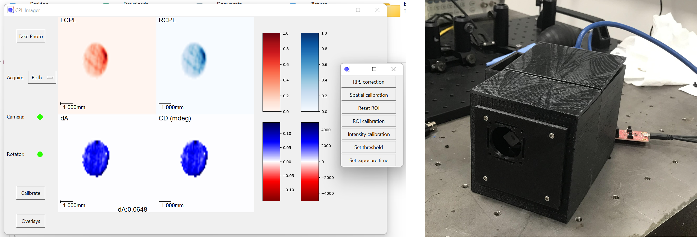

# CPL-Imager

CPL-Imager is the control software for a low-cost, compact imaging system for Circularly Polarized Light (CPL). This repository contains the Python source code for the software, installation instructions and scripts, instrument assembly instructions (including .stl files for 3D printing) and a user manual for the instrument.

The instrument consists of a fresnel rhomb (which converts CPL to linearly polarised light), followed by a linear polariser in a piezoelectric rotation mount and a Thorlabs scientific camera. CPL-Imager controls the rotation of the piezomotor, ensuring subsequent images taken by the camera are of alternating handedness (i.e Left-CPL then Right-CPL then Left-CPL etc.). These LCPL and RCPL images are then combined to calculate differential absorbance (dA) and Circular Dichroism (CD) and these four quantities are then displayed on a live view in the GUI.

## Features:
- Ability to pause the rotator such that only LCPL or RCPL is imaged - useful for calibration as there is no rotator induced delay.
- A variety of calibration options: 
    - Setting the region-of-interest of the camera.
    - Correcting first-order defects relative to a reference polarization state.
    - Indicating if the camera is oversaturated.
    - Masking to eliminate stray light effects.
    - Setting a pixels-per-mm value based on a reference object.
- Visual overlays like a scale tick, axes, grid lines and a cursor based intensity readout allowing for point based measurement.
- User configurable colourmaps 
- The software also works for the 2-CCDI setup where two cameras and a polarized beamsplitter are used in place of the piezoelectric rotator.

## Usage
Once all the prerequisites described in ``install`` are setup, run ``python CPL_Imager.py`` from this directory to start the software (or run the script in an IDE of your choice). 

The respository structure is as follows:
- ``build`` contains all the .STL files needed to 3D print the casing (and sample holders) for the camera.
- ``docs`` contains the manual (inc. instrument assembly instructions) and quick start guide.
- ``docs/installation.txt`` contains instructions to set up the libraries and dlls needed for both the software and the Thorlabs cameras.
- ``photos`` is where images taken by the camera are stored, as well as containing some images used by the software (for icons etc)
- ``config.json`` contains options for the software in .json format, including ROIs, spatial calibration data and the colourmaps used by the software
- The rest of the ".py" files are source code for the software:
    - ``CPL_Imager.py`` is the entry point for the software, which detects and initalises the cameras used.
    - ``rotator.py`` controls the ELL14 piezoelectric rotator
    - ``cameras.py`` controls the connected camera(s) and puts the images taken onto a queue
    - ``colourmapper.py`` colourmaps the image data from the cameras and combines the two input images into a four panel output for display
    - ``GUI.py`` handles the user interface: displaying the live data, handling user interaction and issuing commands to the camera/rotator etc.
    
